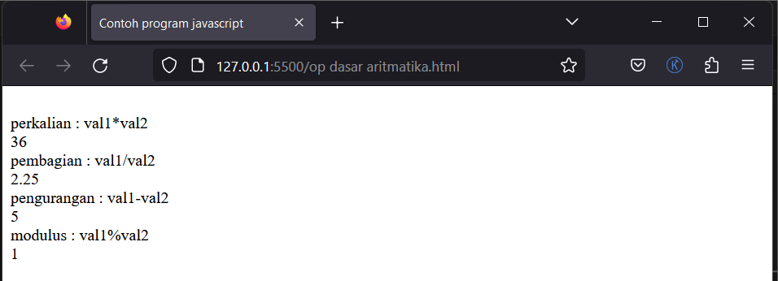
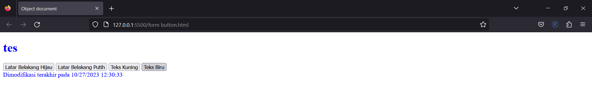

`Nama  : Faizah Via Fadhillah`

`Nim   : 312210460`

`Kelas : TI22.A4`

## Pengantar Javascript

    Javascript adalah bahasa pemrograman yang awalnya dirancang untuk berjalan di atas browser.
    Namun, seiring perkembangan zaman, javascript tidak hanya berjalan di atas browser saja.
    Javascript juga dapat digunakan pada sisi Server, Game, IoT, Desktop, dsb.

    Javascript adalah bahasa pemrograman yang awalnya dirancang untuk berjalan di atas browser.
    Namun, seiring perkembangan zaman, javascript tidak hanya berjalan di atas browser saja.
    Javascript juga dapat digunakan pada sisi Server, Game, IoT, Desktop, dsb.

    JavaScript digunakan untuk memprogram perilaku halaman web, diantaranya adalah:

    - Dapat Mengubah Konten HTML
    - Dapat Mengubah Nilai Atribut HTML
    - Dapat Mengubah Gaya HTML (CSS)
    - Dapat Menyembunyikan Elemen HTML
    - Dapat Menampilkan Elemen HTML

    Dalam HTML, kode JavaScript disisipkan di antara tag <script> dan </script>. 
    Script dapat diletakkan pada tag <head> atau <body>, atau dapat juga diletakkan pada keduanya. 
    JavaScript juga dapat diletakkan pada file external.


# Praktikum 5

1. Pengenalan Javascript

    Script:

    ```html
    <!DOCTYPE html>
    <html lang="en">
    <head>
        <title>Mengenal JavaScript</title>
    </head>
    <body>
        <h1>Pengenalan JavaScript</h1>
        <h3>Contoh document.write dan console.log</h3>
        <script>
            document.write("Hello World");
            console.log("Hello World");
        </script>
    </body>
    </html>
    ```

    Output:

    


2. Pemakaian Alert sebagai property window

    Script:

    ```html
    <!DOCTYPE html>
    <html lang="en">
    <head>
        <meta charset="UTF-8">
        <meta name="viewport" content="width=device-width, initial-scale=1.0">
        <title>alert box</title>
    </head>
    <body>
        <script language = "JavaScript">
            <!--
                window.alert("ini merupakan pesan untuk anda");
            //-->
        </script>
    </body>
    </html>
    ```

    Output:

    


3. Pemakaian method dalam objek

    Script:

    ```html
    <!DOCTYPE html>
    <html lang="en">
    <head>
        <meta charset="UTF-8">
        <meta name="viewport" content="width=device-width, initial-scale=1.0">
        <title>skrip javascript</title>
    </head>
    <body>
        percobaan memakai javascript:<br>
        <script language = "javascript">
            <!--
                document.write("selamat mecoba javascript<br>");
                document.write("semoga sukses!");
            //-->
        </script>
    </body>
    </html>
    ```

    Output:

    


4. Pemakaian Prompt

    Script:

    ```html
    <!DOCTYPE html>
    <html lang="en">
    <head>
        <meta charset="UTF-8">
        <meta name="viewport" content="width=device-width, initial-scale=1.0">
        <title>pemasukan data</title>
    </head>
    <body>
        <script language = "javascript">
            <!--
            var nama = prompt("siapa nama anda?","masukan nama anda");
            document.write("hai, "+nama);  
            //-->
        </script>
    </body>
    </html>
    ```

    Output:

    
    
    


5. Pembuatan fungsi dan cara pemanggilannya

    Script:

    ```html
    <!DOCTYPE html>
    <html lang="en">
    <head>
        <meta charset="UTF-8">
        <meta name="viewport" content="width=device-width, initial-scale=1.0">
        <title>Contoh program javascript</title>
        <script language = "javascript">
            function pesan(){
                alert ("memanggil javascript lewat body onload")
            }
        </script>
    </head>
    <body onload="pesan()">
        
    </body>
    </html>
    ```

    Output:

    


6. Operasi dasar aritmatika

    Script:

    ```html
    <!DOCTYPE html>
    <html lang="en">
    <head>
        <meta charset="UTF-8">
        <meta name="viewport" content="width=device-width, initial-scale=1.0">
        <title>Contoh program javascript</title>
        <script language = "javascript">
            function test (val1,val2)
            {
                document.write("<br>"+"perkalian : val1*val2 "+"<br>")
                document.write(val1*val2)
                document.write("<br>"+"pembagian : val1/val2 "+"<br>")
                document.write(val1/val2)
                document.write("<br>"+"pengurangan : val1-val2 "+"<br>")
                document.write(val1-val2)
                document.write("<br>"+"modulus : val1%val2 "+"<br>")
                document.write(val1%val2)
            }
        </script>
    </head>
    <body>
        <input type="button" name="button1" value="arithmetic" onclick="test(9,4)">
    </body>
    </html>
    ```

    Output:

    

    


7. Seleksi kondisi (if..else)

    Script:

    ```html
    <!DOCTYPE html>
    <html lang="en">
    <head>
        <meta charset="UTF-8">
        <meta name="viewport" content="width=device-width, initial-scale=1.0">
        <title>contoh if-else</title>
    </head>
    <body>
        <script language = "javascript">
            <!--
            var nilai = prompt("nilai (0-100): ", 0);
            var hasil = " ";
            if (nilai >= 60)
            hasil = "lulus";
            else
            hasil = "tidak lulus";
            document.write("hasil: "+ hasil);
            //-->
        </script> 
    </body>
    </html>
    ```

    Output:

    

    


8. Penggunaan operator switch untuk seleksi kondisi

    Script:

    ```html
    <!DOCTYPE html>
    <html lang="en">
    <head>
        <meta charset="UTF-8">
        <meta name="viewport" content="width=device-width, initial-scale=1.0">
        <title>contoh program javascript</title>
        <script language = "javascript">
            function test ( )
            {
            val1=window.prompt("input nilai (1-5):")
            switch (val1)
            {
                case "1":
                    document.write("bilangan satu")
                    break
                case "2":
                    document.write("bilangan dua")
                    break
                case "3":
                    document.write("bilangan tiga")
                    break
                case "4":
                    document.write("bilangan empat")
                    break
                case "5":
                    document.write("bilangan lima")
                    break
                default :
                    document.write("bilangan lainnya")
            }   
            }
        </script>
    </head>
    <body>
        <input type="button" name="button1" value="switch" onclick="test()">
    </body>
    </html>
    ```

    Output:

    

    


9. Form Input

    Script:

    ```html
    <!DOCTYPE html>
    <html lang="en">
    <head>
        <meta charset="UTF-8">
        <meta name="viewport" content="width=device-width, initial-scale=1.0">
        <title>contoh program javascript</title>
        <script language = "javascript">
            function test (){
                var val1 = document.kirim.T1.value
                if (val1%2==0)
                    document.kirim.T2.value="bilangan genap"
                else
                    document.kirim.T2.value="bilangan ganjil"
            }
        </script>
    </head>
    <body>
        <form method="POST" name="kirim">
            <p>BIL <input type="text" name="T1" size="20">
                MERUPAKAN BIL <input type="text" name="T2" size="20">
            </p>
            <p><input type="button" value="TEBAK" name="B1" onclick=test()></p>
        </form>
    </body>
    </html>
    ```

    Output:

    


10. Form Button

    Script:

    ```html
    <!DOCTYPE html>
    <html lang="en">
    <head>
        <meta charset="UTF-8">
        <meta name="viewport" content="width=device-width, initial-scale=1.0">
        <title>Object document</title>
    </head>
    <body>
        <script language = "javascript">
            <!--
                function ubahWarnaLB(warna) {
                    document.bgColor = warna;
                }
                function ubahWarnaLD(warna){
                    document.fgColor = warna;
                }
            //-->
        </script>
        <h1>tes</h1>
        <form>
            <input type="button" value="Latar Belakang Hijau" onclick="ubahWarnaLB('GREEN')">
            <input type="button" value="Latar Belakang Putih" onclick="ubahWarnaLB('WHITE')">
            <input type="button" value="Teks Kuning" onclick="ubahWarnaLD('YELLOW')">
            <input type="button" value="Teks Biru" onclick="ubahWarnaLD('BLUE')">
        </form>
        <script language = "javascript">
            <!--
            document.write("Dimodifikasi terakhir pada " +
            document.lastModified);
            //-->
        </script>
    </body>
    </html>
    ```

    Output:

    

    

    

    


11. HTML DOM (Pilihan menggunakan checkBox dengan perhitungan otomatis)

    Script:

    ```html
    <!DOCTYPE html>
    <!--
        File: daftar_menu.html
    //-->
    <html lang="en">
    <head>
        <meta charset="UTF-8">
        <meta name="viewport" content="width=device-width, initial-scale=1.0">
        <title>Daftar Menu</title>
        <script>
            function hitung(ele) {
                var total = document.getElementById('total').value;
                    total = (total ? parseInt(total) : 0);
                var harga = 0;

                if (ele.checked) {
                    harga = ele.value;
                    total += parseInt(harga);
                } else {
                    harga = ele.value;
                    if (total > 0)
                        total -= parseInt(harga);
                }

                document.getElementById('total').value = total;
            }
        </script>
    </head>
    <body>
        <h1>Daftar Menu Makanan</h1>
        <label><input type="checkbox" value="5000" id="menu1" onclick="hitung(this);"/> Ayam Goreng Rp. 5.000</label><br />
        <label><input type="checkbox" value="500" id="menu2" onclick="hitung(this);"/> Tempe Goreng Rp. 500</label><br />
        <label><input type="checkbox" value="2500" id="menu3" onclick="hitung(this);"/> Telur Dadar Rp. 2.500</label><hr />
        <strong>Total Bayar: Rp. <input id="total" type="text" /></strong>
    </body>
    </html>
    ```

    Output:

    


# Tugas 


